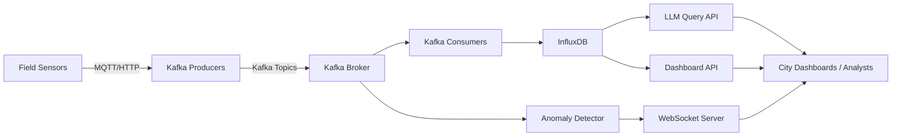
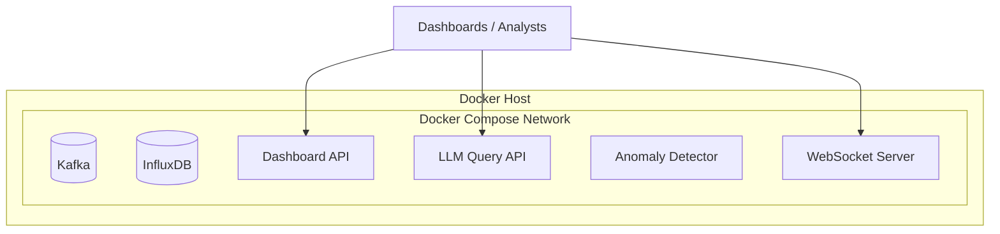

# Digital Twin Den Bosch Backend — Runner 3.0

    

A production-grade backend for the Digital Twin of Den Bosch. It ingests real-time sensor data, stores time-series metrics, exposes REST APIs for dashboards, and provides a natural-language query interface for analytics.

Version: Runner 3.0

**Quick Links:** 📘 Overview · 🧭 Architecture · 🚀 Quick Start · ⚙️ Configuration · ☁️ Azure Deployment · 🩺 Operations

## Table of Contents

- Overview
- Architecture
- Core Services
- Data Flow
- Technology Stack
- Repository Structure
- Quick Start (Docker)
- Configuration
- Local Development
- Azure Deployment (VM + Docker Compose)
- Operations
- Security
- License

## Overview

This backend consolidates environmental sensor streams (CO2, NO2, PM2.5, noise, and location metadata) into a time-series store and exposes multiple access paths:

- REST APIs for dashboards and reporting
- Natural language queries translated into database queries
- Real-time streaming for live monitoring
- Anomaly detection and alerting

## 👥 Audience

- 👤 City Ops: live monitoring and incident response
- 👤 Data Analysts: historical trends and ad-hoc queries
- 👤 Platform Engineers: deployment, scaling, and reliability

## Architecture

### System Overview



### Deployment Topology (Docker Compose)



## Core Services

- Dashboard API: Aggregated metrics for dashboards
- LLM Query API: Natural-language interface to time-series data
- Kafka Producers: Sensor stream ingestion and simulation
- Kafka Consumers: Stream processing and persistence to InfluxDB
- Anomaly Detector: Rule-based and statistical checks
- WebSocket Server: Live updates to clients

## Data Flow

1. Sensors or simulators publish to Kafka topics
2. Consumers persist metrics in InfluxDB
3. APIs query InfluxDB for dashboards and analysis
4. WebSocket server pushes real-time updates
5. Detector flags anomalies and emits alerts

## Technology Stack

- Backend: Python 3, Flask
- Streaming: Apache Kafka
- Time-Series Storage: InfluxDB
- LLM Integration: External API provider (configured by env)
- Orchestration: Docker Compose
- Real-Time: WebSockets

## Repository Structure

```
digitaltwindenboschbackend/
├── apis/
│   ├── dashboard_api.py
│   ├── llm_influx_query_engine.py
│   └── explainer.py
├── config/
│   ├── docker-compose.yml
│   ├── docker-compose-new.yml
│   ├── telegraf.conf
│   └── telegraf_new.conf
├── consumers/
│   ├── kafka_consumer_influx.py
│   └── kafka_consumer_anomalies.py
├── data/
│   └── *.csv
├── detectors/
│   ├── anomaly_detector_websocket.py
│   └── detector_evaluation.py
├── docs/
│   └── README.md
├── evaluation/
│   └── *.csv
├── producers/
│   ├── kafka_producer_simulator.py
│   └── kafka_simulator_correlation.py
├── tests/
│   └── quick_test.py
├── utils/
│   ├── metrics_reader.py
│   ├── socket_client_tester.py
│   ├── websocket_server_emitter.py
│   ├── odin_metrics.py
│   └── odin_brain.py
├── .env.example
├── README.md
└── requirements.txt
```

## Quick Start (Docker)

```bash
cp .env.example .env
# Edit .env with real values

docker-compose -f config/docker-compose.yml up --build -d
```

Verify health endpoints:

```bash
curl http://localhost:5001/health
curl http://localhost:5050/health
```

## Configuration

Create a local `.env` file based on `.env.example`.

Required variables:

- INFLUX_URL
- INFLUX_TOKEN
- INFLUX_ORG
- BUCKET
- HYPERBOLIC_API_KEY (or equivalent LLM provider key)
- KAFKA_BOOTSTRAP_SERVERS

## Local Development

Install dependencies and run services manually:

```bash
pip install -r requirements.txt

# Terminal 1: Dashboard API
python apis/dashboard_api.py

# Terminal 2: LLM Query API
python apis/llm_influx_query_engine.py

# Terminal 3: Kafka Producer
python producers/kafka_producer_simulator.py

# Terminal 4: Kafka Consumer
python consumers/kafka_consumer_influx.py
```

## Azure Deployment (VM + Docker Compose)

This stack is multi-service and runs cleanly on a Linux VM using Docker Compose. The steps below reference official Azure and Docker documentation.

1) Create an Ubuntu Linux VM in Azure.
   - Use the Azure portal quickstart for VM creation and SSH access. citeturn0search2

2) Install Docker Engine and Docker Compose on the VM.
   - Follow Docker’s official Ubuntu installation guide. citeturn0search1

3) Deploy the stack.

```bash
# On the VM
git clone <repository-url>
cd digitaltwindenboschbackend
cp .env.example .env
# Edit .env with production values

docker-compose -f config/docker-compose.yml up --build -d
```

4) Open required ports in Azure NSG:
- 5001 (Dashboard API)
- 5050 (LLM Query API)
- 8080 (WebSocket)
- 8086 (InfluxDB, if needed externally)

## Operations

Health checks:

```bash
curl http://localhost:5001/health
curl http://localhost:5050/health
```

Logs:

```bash
docker-compose -f config/docker-compose.yml logs -f
```

## Security

- Keep `.env` out of version control.
- Rotate tokens regularly.
- Use private subnets and NSG rules to limit external exposure.
- For production, front APIs with a reverse proxy and TLS termination.

## License

This project is licensed under the MIT License. See `LICENSE`.
